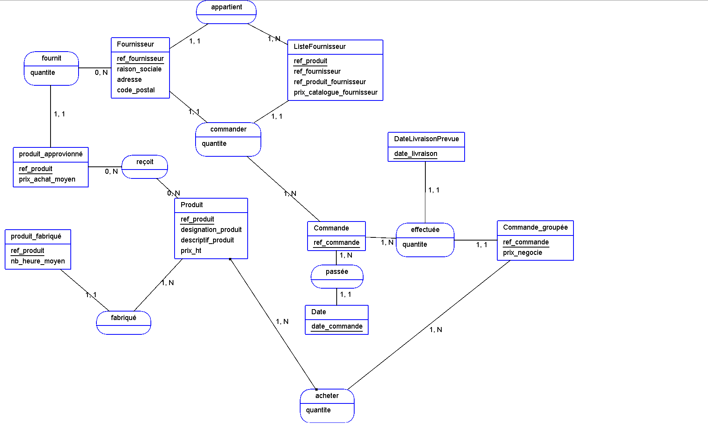
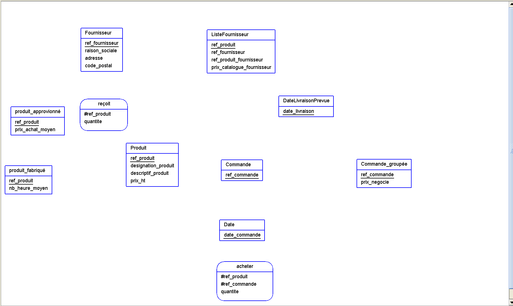

# EXAMEN PRATIQUE

## Exercice 1

### Dictionnaire de données


### Modèle Conceptuel des Données.



### Modèle Logique des Données.



### Modèle Physique des Données

```SQL
CREATE TABLE Produit (
    ref_produit VARCHAR(20) PRIMARY KEY,
    designation_produit VARCHAR(20),
    description_produit TEXT,
    prix_HT DECIMAL,
);

CREATE TABLE produit_fabrique (
    ref_produit VARCHAR PRIMARY KEY,
    nb_heure_moyen DECIMAL,
   
);

CREATE TABLE ProduitApprovisionne (
    ref_produit VARCHAR PRIMARY KEY,
    prix_achat_moyen DECIMAL,

);

CREATE TABLE Fournisseur (
    ref_fournisseur VARCHAR PRIMARY KEY,
    raison_sociale VARCHAR(20),
    adresse VARCHAR(40),
    ville VARCHAR(30),
    code_postal VARCHAR(5)
);

CREATE TABLE ListeFournisseurs (
    ref_produit VARCHAR(20),
    ref_fournisseur VARCHAR(20),
    ref_produit_fournisseur VARCHAR(20),
    prix_catalogue_fournisseur DECIMAL,
    PRIMARY KEY (RefProduit, RefFournisseur),
   
);

CREATE TABLE Commande (
    ref_commande VARCHAR PRIMARY KEY,
    date_ommande DATE,
    ref_fournisseur VARCHAR,
    TotalCommandeHT DECIMAL,
  
);

CREATE TABLE LigneCommande (
    ref_commande VARCHAR(20),
    ref_produit VARCHAR(20),
    quantite INT,
    prix_negocie DECIMAL(10, 2),
    date_livraison DATE,
    PRIMARY KEY (RefCommande, RefProduit),

);
```